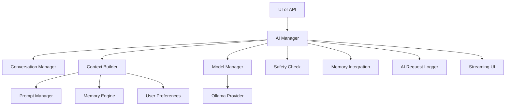
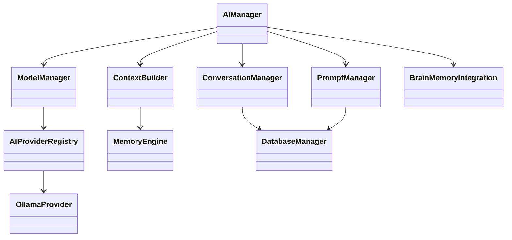

# TerryGPT Brain

## Purpose

The Brain is the intelligence layer.

Every future feature should talk to `AIManager`.

Other modules should not call Ollama, prompts, memory, or conversations directly.

## Data Flow

## Class Diagram

## Responsibilities

1. `AIManager`: one public interface for intelligence.
2. `ConversationManager`: create, rename, archive, restore, delete, search, and store messages.
3. `ModelManager`: detect and cache Ollama model metadata.
4. `PromptManager`: store versioned prompt templates and render variables.
5. `ContextBuilder`: build optimized model input from history, memory, preferences, project data, and prompts.
6. `BrainMemoryIntegration`: save important memories and ignore trivial conversations.
7. `OllamaProvider`: local provider adapter.

## Extension Points

1. Add another provider by implementing the provider protocol in `src/terrygpt/ai/providers.py`.
2. Register the provider in `CoreManager.build`.
3. Keep all feature code calling `AIManager`.
4. Add new prompt types through `PromptManager`.
5. Add stronger vector memory later behind `MemoryEngine`.

## Phase 3 Boundaries

Not included:

1. Voice.
2. Vision.
3. OCR.
4. Video.
5. Browser automation.
6. File automation.
7. Agents.
8. Android.

