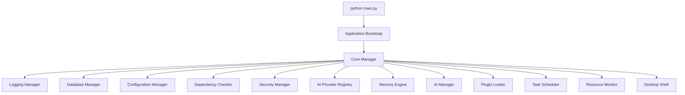
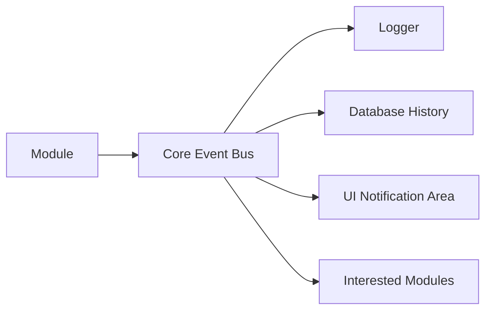

# TerryGPT Core Engine

## Purpose

The Core Engine starts, stops, monitors, and connects TerryGPT subsystems.

Modules do not call each other directly.

They communicate through:

1. Core Manager.
2. Event Bus.
3. Shared configuration.
4. Shared database service.

## Startup Flow

## Event Flow

## Subsystems

1. `core`: lifecycle, recovery, events.
2. `configuration`: persistent runtime settings.
3. `database`: migrations and SQLite access.
4. `logging`: rotating category logs.
5. `memory`: long-term memory records and ranked search.
6. `ai`: provider interface and Ollama detection.
7. `plugins`: plugin detection, enable, disable, install, uninstall.
8. `tasks`: background queue, priority, retries, cancellation, progress.
9. `security`: permissions, confirmations, audit events.
10. `resources`: CPU, GPU, RAM, disk, network snapshots.
11. `gui`: desktop shell.
12. `brain`: AI Manager, conversations, prompts, context, model detection, and response pipeline.

## Recovery Rule

If one module fails:

1. The failure is logged.
2. A notification event is created.
3. The Core Manager can attempt one restart.
4. Other modules continue running.

## Phase 2 Boundary

Phase 2 does not expose AI chat, image tools, video tools, automation execution, or computer control.
